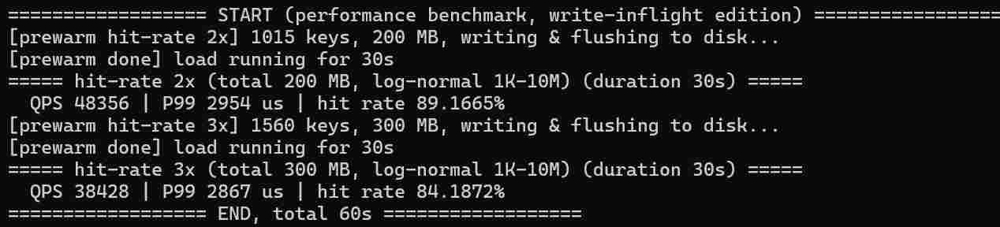

# Release删除测试点代码

## 无预热数据（缓存充足）

首轮：

```
======== START (performance benchmark, write-inflight edition) ========
[prewarm [1] QPS - read-only] pool 344 keys, 101 MB, writing & flushing to disk...
[prewarm done] load running for 30s (WRITE_INFLIGHT=4)
[read-only] hot subset 344 keys / 101 MB (memory-hit reads; cold/disk reads -> hit-rate scenes)
===== [1] QPS - read-only (duration 30s) =====
QPS 650117 | P99 62 us | hit rate 100%

[prewarm [2] QPS - read70/write30] pool 344 keys, 101 MB, writing & flushing to disk...
[prewarm done] load running for 30s (WRITE_INFLIGHT=4)
===== [2] QPS - read70/write30 (duration 30s) =====
QPS 361925 | P99 643 us | hit rate 100%

[prewarm [3] QPS - write-only] pool 344 keys, 101 MB, writing & flushing to disk...
[prewarm done] load running for 30s (WRITE_INFLIGHT=4)
===== [3] QPS - write-only (duration 30s) =====
QPS 145117 | P99 705 us | hit rate 0%
======== END ========
```


## 缓存爆满

缓存：数据量：磁盘 = 1:3:5

```
================== START (performance benchmark, write-inflight edition) ==================
[prewarm [1] QPS - read-only] pool 717 keys, 301 MB, writing & flushing to disk...
[prewarm done] load running for 30s (WRITE_INFLIGHT=4)
[read-only] hot subset 186 keys / 70 MB (memory-hit reads; cold/disk reads -> hit-rate scenes)
===== [1] QPS - read-only (duration 30s) =====
  QPS 643575 | P99 58 us | hit rate 99.9988%
[prewarm [2] QPS - read70/write30] pool 717 keys, 301 MB, writing & flushing to disk...
[prewarm done] load running for 30s (WRITE_INFLIGHT=4)
===== [2] QPS - read70/write30 (duration 30s) =====
  QPS 124780 | P99 3787 us | hit rate 96.3445%
[prewarm [3] QPS - write-only] pool 717 keys, 301 MB, writing & flushing to disk...
[prewarm done] load running for 30s (WRITE_INFLIGHT=4)
===== [3] QPS - write-only (duration 30s) =====
  QPS 49915 | P99 3863 us | hit rate 0%
```

```
================== START (performance benchmark, write-inflight edition) ==================
[prewarm [1] QPS - read-only] pool 717 keys, 301 MB, writing & flushing to disk...
[prewarm done] load running for 30s (WRITE_INFLIGHT=4)
[read-only] hot subset 186 keys / 70 MB (memory-hit reads; cold/disk reads -> hit-rate scenes)
===== [1] QPS - read-only (duration 30s) =====
  QPS 803651 | P99 90 us | hit rate 99.9991%
[prewarm [2] QPS - read70/write30] pool 717 keys, 301 MB, writing & flushing to disk...
[prewarm done] load running for 30s (WRITE_INFLIGHT=4)
===== [2] QPS - read70/write30 (duration 30s) =====
  QPS 121044 | P99 3889 us | hit rate 96.283%
[prewarm [3] QPS - write-only] pool 717 keys, 301 MB, writing & flushing to disk...
[prewarm done] load running for 30s (WRITE_INFLIGHT=4)
===== [3] QPS - write-only (duration 30s) =====
  QPS 51880 | P99 3834 us | hit rate 0%
```


### 73读写详细测试报告

```
[prewarm [2] QPS - read70/write30] pool 717 keys, 301 MB, writing & flushing to disk...
[prewarm done] load running for 30s (WRITE_INFLIGHT=4)
===== [2] QPS - read70/write30 (duration 30s) =====
  requests: 3751147 | QPS 125038
  latency(us): mean 302 | P50 6 | P99 3793 | P999 7138
  cache: hit 2530475 / miss 95058 -> hit rate 96.3795%
  evict: 4288 calls / 131107 items / avg 0.0886273 ms per call / evict-ratio 1.26678%
  disk-write: 66227 recs / 5996 MB
    build(serialize) 1606 ms | file-write 4974 ms | flush 7 ms (4337 calls)
    per-write avg: build 24 us | file 75 us
  disk-ovw/holes: overwrite 31364 (same 0 / shrink 31364) | hole-use 27533 | holes 295 segs / 23 MB
  disk-read: 95058 reads / 20229 ms (avg 212 us)
  disk-sel: calls 95058 | inDisk-miss 0 (0%) | file-fail 0 | file-ok 95058
  disk-sel-fail: check 0 | name 0 | eof 0 | type 0 | open 0
  disk-queue: depth avg 4.65685 / max 13 | worker busy 29384 ms = 97.9476% (141279 tasks)
  disk-compact: 16 runs / fail 0 | time 1446 ms (avg 90.4359 ms/call) | file 7991MB -> 2172MB (reclaim 5819MB)
================== END, total 30s ==================
```


## 命中率测试

**纯读 + 冷热80/20 + 数据量2~3倍缓存。**

```
================== START (performance benchmark, write-inflight edition) ==================
[prewarm hit-rate 2x] 1015 keys, 200 MB, writing & flushing to disk...
[prewarm done] load running for 30s
===== hit-rate 2x (total 200 MB, log-normal 1K-10M) (duration 30s) =====
  QPS 48356 | P99 2954 us | hit rate 89.1665%
[prewarm hit-rate 3x] 1560 keys, 300 MB, writing & flushing to disk...
[prewarm done] load running for 30s
===== hit-rate 3x (total 300 MB, log-normal 1K-10M) (duration 30s) =====
  QPS 38428 | P99 2867 us | hit rate 84.1872%
================== END, total 60s ==================
```


