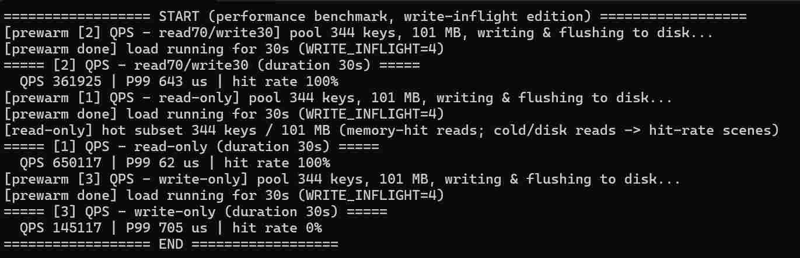

# Release删除测试点代码

## 无预热数据（缓存充足）

首轮：

```
================== START (performance benchmark) ==================
[prewarm [1] QPS - read-only] pool 2 keys, 1 MB, writing & flushing to disk...
[prewarm done] load running for 30s
===== [1] QPS - read-only (duration 30s) =====
  requests: 24654850 | QPS 821828
  latency(us): mean 9 | P50 8 | P99 39 | P999 131
[prewarm [2] QPS - read70/write30] pool 2 keys, 1 MB, writing & flushing to disk...
[prewarm done] load running for 30s
===== [2] QPS - read80/write20 (duration 30s) =====
  requests: 3482876 | QPS 116095
  latency(us): mean 68 | P50 9 | P99 1983 | P999 4760
[prewarm [3] QPS - write-only] pool 2 keys, 1 MB, writing & flushing to disk...
[prewarm done] load running for 30s
===== [3] QPS - write-only (duration 30s) =====
  requests: 950809 | QPS 31693
  latency(us): mean 252 | P50 16 | P99 4387 | P999 19967
```


## 缓存爆满

缓存：数据量：磁盘 = 1:3:5

```
================== START (performance benchmark, write-inflight edition) ==================
[prewarm [1] QPS - read-only] pool 717 keys, 301 MB, writing & flushing to disk...
[prewarm done] load running for 30s (WRITE_INFLIGHT=4)
[read-only] hot subset 186 keys / 70 MB (memory-hit reads; cold/disk reads -> hit-rate scenes)
===== [1] QPS - read-only (duration 30s) =====
  QPS 643575 | P99 58 us | hit rate 99.9988%
[prewarm [2] QPS - read70/write30] pool 717 keys, 301 MB, writing & flushing to disk...
[prewarm done] load running for 30s (WRITE_INFLIGHT=4)
===== [2] QPS - read70/write30 (duration 30s) =====
  QPS 124780 | P99 3787 us | hit rate 96.3445%
[prewarm [3] QPS - write-only] pool 717 keys, 301 MB, writing & flushing to disk...
[prewarm done] load running for 30s (WRITE_INFLIGHT=4)
===== [3] QPS - write-only (duration 30s) =====
  QPS 49915 | P99 3863 us | hit rate 0%
```



## 命中率测试

**纯读 + 冷热80/20 + 数据量2~3倍缓存。**

```
================== START (performance benchmark, write-inflight edition) ==================
[prewarm hit-rate 2x] 1015 keys, 200 MB, writing & flushing to disk...
[prewarm done] load running for 30s
===== hit-rate 2x (total 200 MB, log-normal 1K-10M) (duration 30s) =====
  QPS 48356 | P99 2954 us | hit rate 89.1665%
[prewarm hit-rate 3x] 1560 keys, 300 MB, writing & flushing to disk...
[prewarm done] load running for 30s
===== hit-rate 3x (total 300 MB, log-normal 1K-10M) (duration 30s) =====
  QPS 38428 | P99 2867 us | hit rate 84.1872%
================== END, total 60s ==================
```


